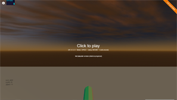

Rescue Me
=========

*A WebGL game experiment using Three.js, Physijs, and other libs*

The main Objective of this project is learn 3D through a little video game, that will include almost all the techniques used in the industry. Like physics, in-game cinematics, animated characters, dialogues, GUI, etc.

  

Who made this
--------------

| 
|---
| [Ferran Pons](https://github.com/ferranpons)

Hi! I'm Ferran Pons; a Senior Android Developer that works for Schibsted Spain developing the Vibbo application. With almost 12 years of experience as a programmer, my experience covers a lot of different kind of applications, from web app development to the desktop, mobile apps and videogames. I've participated in some blockbuster games such as Burnout Paradise, DeadSpace and the Skate franchise. Also I've tried to start up my own indie videogame studio, labeled "Retrowax Games" with which I've made this game that it's published for the Xbox360 and Windows Phone and PC Windows.

Bugs and Feedback
-----------------

For bugs, questions and discussions please use the [Github Issues](https://github.com/ferranpons/rescue_me/issues).

Licensing
---------

Copyright 2016 Ferran Pons

Licensed under the Apache License, Version 2.0 (the "License");
you may not use this file except in compliance with the License.
You may obtain a copy of the License at

    http://www.apache.org/licenses/LICENSE-2.0

Unless required by applicable law or agreed to in writing, software
distributed under the License is distributed on an "AS IS" BASIS,
WITHOUT WARRANTIES OR CONDITIONS OF ANY KIND, either express or implied.
See the License for the specific language governing permissions and
limitations under the License.
